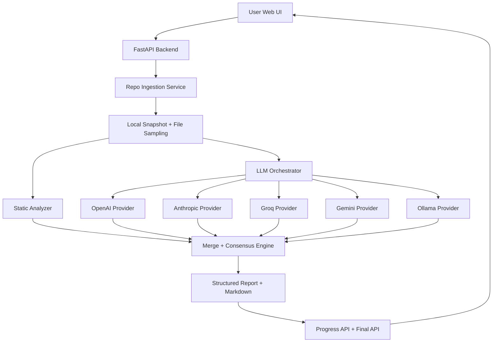

# Automatic Code Reviewer — Design Document

## 1. Objective
Build an intelligent, production-ready automatic code review platform that:
- Accepts a GitHub repository URL
- Runs hybrid review using static analysis + multiple LLM families
- Produces a structured, actionable report
- Shows real-time model progress while review is running

---

## 2. Product Scope
### In Scope
- Repository ingestion from GitHub URL
- Multi-model review (OpenAI, Anthropic, Groq, Gemini, Ollama)
- Static rule-based analysis
- Progressive report updates in UI
- Final detailed report + markdown download

### Out of Scope (current version)
- Persistent job history database
- User authentication and multi-tenant access control
- PR comment bot / GitHub App integration
- Distributed worker queue

---

## 3. High-Level Architecture

---

## 4. Core Components

### 4.1 API Layer (`app/main.py`)
- Serves web UI and static assets
- Exposes APIs:
  - `POST /api/review/start` (start async review job)
  - `GET /api/review/{job_id}` (poll progressive status)
  - `POST /api/review` (single-shot synchronous review)
  - `GET /health`
- Holds in-memory job state (`REVIEW_JOBS`) for progress updates

### 4.2 Repository Ingestion (`app/services/repository.py`)
- Performs shallow clone of target repository
- Filters analyzable files by extension and ignored directories
- Applies constraints (`MAX_FILES`, `MAX_FILE_CHARS`)
- Builds repository snapshot with language + line statistics

### 4.3 Static Analyzer (`app/services/analyzers.py`)
- Deterministic pattern checks for:
  - potential secrets
  - technical debt markers (TODO/FIXME/HACK)
  - readability issues
- Emits issues with severity, category, rationale, suggestion, confidence

### 4.4 LLM Providers (`app/services/providers.py`)
Adapter-based provider design:
- `OpenAIProvider`
- `AnthropicProvider`
- `GroqProvider`
- `GeminiProvider`
- `OllamaProvider`

Common behaviors:
- Provider-specific payload compaction
- JSON output constraints in prompt
- Robust response parsing
- Error-safe fallback model review object

Special handling:
- Groq payload-too-large retry with smaller context
- Groq/Gemini/OpenAI/Anthropic JSON extraction even with fenced/truncated responses
- Ollama endpoint compatibility (`/api/generate` and `/v1/chat/completions`)
- Ollama model fallback from available local tags

### 4.5 Orchestration + Consensus (`app/services/orchestrator.py`)
- Runs static analysis first
- Executes model providers progressively
- Emits per-model status updates (`queued/running/completed/failed/unavailable`)
- Merges findings by normalized key + confidence preference
- Calculates overall risk score from available responders

### 4.6 Report Builder (`app/services/report.py`)
- Generates rich markdown output:
  - repository snapshot
  - executive summary
  - coverage and reliability
  - severity-grouped findings
  - model-by-model outputs
  - quick wins

### 4.7 Frontend (`templates/index.html`, `static/js/app.js`)
- Collects repo URL + optional branch
- Starts background review job
- Polls progress endpoint
- Renders:
  - animated live model status tracker
  - partial/final report sections
  - downloadable markdown report

---

## 5. Data Model (Conceptual)

### Review Job
- `job_id`
- `status`: queued/running/completed/failed
- `stage`
- `progress` (0-100)
- `completed_models`, `total_models`
- `model_statuses[]`
- `partial_report`
- `report`
- `error`

### Review Report
- repository metadata
- executive summary
- overall risk score
- strengths
- merged key findings
- per-model review outputs
- coverage info
- quick wins
- markdown report text

---

## 6. Runtime Flow
1. User submits repo URL.
2. Backend creates job and returns `job_id` immediately.
3. Repo is cloned and sampled.
4. Static analyzer runs; first partial report appears.
5. Each model runs; UI updates status and report incrementally.
6. Findings are merged into final consensus report.
7. User sees final report and can export markdown.

---

## 7. Reliability and Error Handling
- Provider failures do not fail entire job.
- Each provider returns explicit error details when unavailable.
- Coverage section records model failures/unavailability.
- Empty/invalid model output is captured with fallback summaries.
- Ollama model auto-fallback prevents hard failure on missing model name.

---

## 8. Security Considerations
- API keys read from environment variables (`.env`)
- `.env` excluded from git via `.gitignore`
- Secret values should never be committed
- Rotate any key exposed in logs/chat/history
- For private codebases, prefer local model path (Ollama) or approved cloud policy

---

## 9. Deployment Design
### Local
- `python -m uvicorn app.main:app --host 127.0.0.1 --port 8000`

### Container
- `Dockerfile` + `docker-compose.yml`

### Cloud-ready targets
- Render / Railway / Fly.io / VM
- Requires env var setup for selected providers

---

## 10. Performance Strategy
- File and content sampling limits
- Provider-specific prompt compaction
- Progressive execution for better perceived responsiveness
- Lightweight in-memory job store for MVP speed

---

## 11. Current Limitations
- In-memory job state (lost on restart)
- No persistent report history
- No authentication layer
- No distributed workers for very high throughput

---

## 12. Future Improvements
- Redis/Celery or queue-based background workers
- Persistent DB for reports/jobs/audit
- GitHub PR integration (comments/checks)
- Role-based access controls
- Evaluation harness for model agreement scoring
- Cost/performance routing across model providers

---

## 13. Why This Design Works for Real Use
- Hybrid static + multi-LLM review improves coverage quality.
- Provider adapters make architecture extensible.
- Progressive UX improves trust and usability.
- Structured output + markdown export makes findings actionable for teams.
